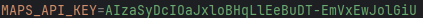
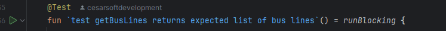

# Teste Android

# **Visão Geral**

O projeto foi criado na arquitetura MVVM + Clean architecture para atender a solicitação no desafio de buscar informações do transporte público em tempo real

Para tal objetivo criei uma chave de API(API DO OLHO VIVO) para acessar os endpoints e uma api do google maps no google cloud
apenas para efetuação dos testes

Algumas das tecnologias utilizadas no projeto foram:
- Dagger Hilt para injeção de dependência
- Mockito para criação de testes unitários
- Retrofit para chamada de rede
- Maps API para criação de mapas dinamicos no android
- Jetpack components criação de navegação, viewmodels, Room, etc

# **Instalação**

Para instalar o projeto você precisa:

1. clonar o projeto na sua máquina : ``git clone {caminho}`` 
ou baixar no github

2. Abrir o projeto em : AikoPublicTransport

3. Adicionar o seguinte trecho com a chave do google maps no ``local.properties`` do android studio:

4. Executar a aplicação em um celular ou emulador

# Aplicando testes

Apliquei testes para ver se o retorno da API estava de acordo com o model. Realizei outro teste unitário do RemoteDataSource

Para executar os testes vá para: 
test > data > remote > network | test > data > remote > repository > datasourceimpl

Execute os testes 

# **Uso da aplicação**

O aplicativo oferece 4 telas que são:

- Primeira splash com o icone da Aiko que contem uma breve animação para Home

- Segunda tela contendo histórico de pesquisa em cache no celualar, cada pesquisa, salvo a pesquisa para visualizar as pesquisas recentes(FUNCIONALIDADE IMCOMPLETA)

- Terceira tela para buscar na barra de pesquisa e escolher uma linha para direcionamento ao mapa

- Quarta tela de mapas que mostra a posição dos veículos e paradas através de uma linha escolhida pelo usuário que ao clicar em uma das paradas mostrará uma lista de veículos e sua previsão de chegada

# Recursos
 - Linhas: Na tela de Buscar Linhas, o usuário consegue ver as informações sobre a linha de ônibus

- Posições dos veículos e paradas: Ao buscar na tela de Buscar Linhas, você vai escolher a linha por nome ou código para buscar as paradas e os veículos, ao escolher você será direcionado ao mapa onde mostrará a posição dos veículos e paradas 

- Previsão de chegada : Ao clicar em uma das paradas no mapa será exibido uma lista com a previsão de chegada de cada veículo que passe pela parada escolhida

